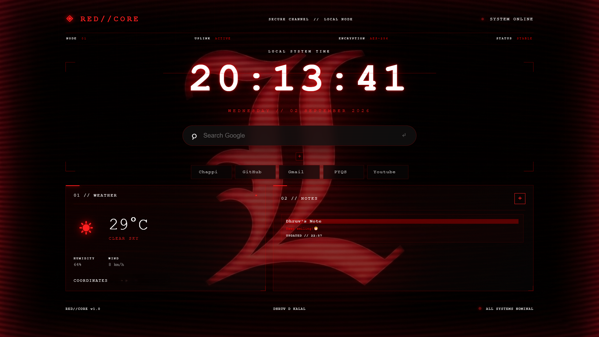

# 🔴 RED//CORE

> A cyber-themed Chrome New Tab extension built with HTML, CSS and JavaScript.

RED//CORE transforms the default Chrome New Tab page into a futuristic red-and-black dashboard with productivity tools, a digital clock, weather information, notes, website shortcuts, and customizable themes.

---

## 🖥️ Preview

<!-- Add your main screenshot here -->

<p align="center">
  
</p>


---

## 🔗 GitHub Repository

<p align="center">

[GIHUB REPO](https://github.com/Dhruvkalal90/RED-CORE.git)

</p>


---

# ✨ Features

## 🕒 Modern Digital Clock

A large digital clock is displayed at the center of the dashboard.

- Real-time clock
- Automatic date display
- Cyber-style typography
- Red glow effects
- Live system indicator

---

## 🔎 Google Search

A Google-style search bar is integrated directly into the New Tab page.

Features:

- Google search
- Press `Enter` to search
- Minimal interface
- RED//CORE styling
- Keyboard-friendly

---

## 🌤️ Weather

RED//CORE can display current weather information using the user's location.

Displays:

- 🌡️ Temperature
- ☁️ Weather condition
- 💧 Humidity
- 💨 Wind speed
- 📍 Location information

Weather data is retrieved using the Open-Meteo API.
---

## 📥 Installation

Follow the steps below to install **RED//CORE** as a Chrome extension.

### 1. Clone the Repository

Open a terminal / Command Prompt and run:

```bash
git clone https://github.com/YOUR-USERNAME/RED-CORE.git
```

Then move into the project folder:
```bash
cd RED-CORE
```

## OR

### 2. Download ZIP Instead

If you don't want to use Git:

- Open the RED//CORE GitHub repository.
- Click Code.
- Click Download ZIP.
- Extract the downloaded ZIP file.
- You should have a folder containing the extension files.

Example:

RED-CORE/<br>
├── manifest.json<br>
├── newtab/<br>
├── assets/<br>
└── README.md<br>

### 🌐 3. Open Chrome Extensions

Open Google Chrome and go to:

chrome://extensions/

Alternatively:

Click the ⋮ menu in Chrome.
Select Extensions.
Select Manage Extensions.
### 🛠️ 4. Enable Developer Mode

On the Chrome Extensions page:

Find Developer mode in the top-right corner.
Turn it ON.

You should now see additional options such as:

Load unpacked
Pack extension
Update
### 📦 5. Load RED//CORE

Click:

Load unpacked

Then select the root folder of the RED//CORE project.

`Do not select the newtab folder.`

Select the main project folder containing:

manifest.json

### 🔄 6. Reload the Extension

After loading the extension:

Find RED//CORE in the extensions list.
If necessary, click the Reload ↻ button.
Open a new Chrome tab.

RED//CORE should now replace Chrome's default New Tab page.

### 🧪 7. Development / Updating

If you modify the extension source code:

HTML
CSS
JavaScript
manifest.json

return to:

chrome://extensions/

and click:

Reload ↻

Then open a new tab to see the changes.

### 🗑️ 8. Uninstall / Remove

To remove RED//CORE:

Open:
chrome://extensions/
Find RED//CORE.
Click Remove.
Confirm the removal.

Chrome will return to its normal New Tab page.

---

## 📝 Notes

A persistent notes system is built directly into the dashboard.

### Features

- Create notes
- Edit notes
- Delete notes
- Multiple notes
- Persistent storage
- Notes remain after restarting Chrome
- Cyber-themed note editor

Notes are stored using:

```text
chrome.storage.local